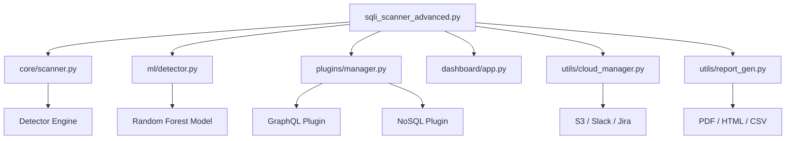

# 🏗️ VIP SQLi Scanner v2.2 Architecture

The v2.2 upgrade transforms the script into a modular platform designed for high-performance triage and enterprise integration.

## 🧱 Design Methodology

The system follows a **Modular Plugin-First** architecture. By decoupling detection, scanning, and reporting, we gain significant stability and extensibility.

## 📂 Project Structure

### `core/`
The heartbeat of the scanner. Handles request orchestration, concurrent execution, and baseline/payload comparison.

### `ml/`
Intelligence layer. Contains feature extraction logic and the pre-trained Random Forest model for behavior-based scanning.

### `plugins/`
Extensibility layer. Logic for non-SQL database types (GraphQL/NoSQL) resides here, allowing for niche detection without bloating the core.

### `dashboard/`
Visualization layer. A Flask-SocketIO server that provides a real-time reactive UI.

### `utils/`
The "connectors". Handles the heavy lifting for external integrations (reporting and cloud providers).

## 🧬 Core Workflow

1.  **Ingestion**: URLs are parsed and filtered against `exclusions.txt`.
2.  **Detection**:
    *   **Rule-Based**: Traditional signature and behavior checks.
    *   **ML-Based**: Parallel analysis of response features.
    *   **Plugin**: specialized checks for specific tech stacks.
3.  **Broadcasting**: Real-time results are emitted to the Dashboard via SocketIO.
4.  **Reporting**: Final results are exported to localized files and synced to Cloud (S3/Slack).

---
**EST 2026 . viphacker100**
